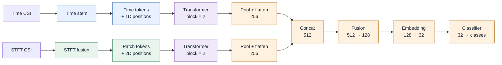
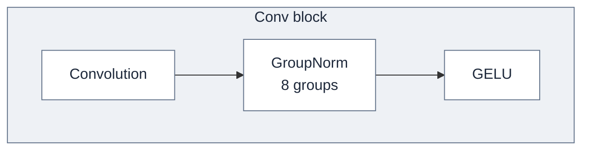
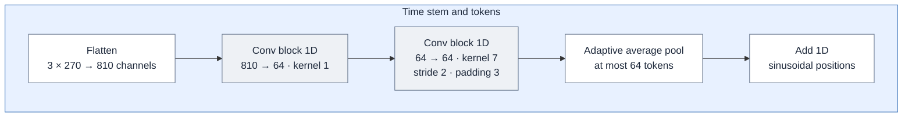
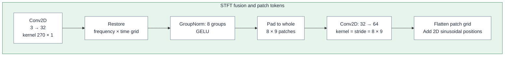
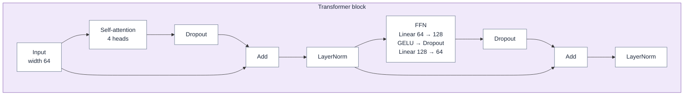
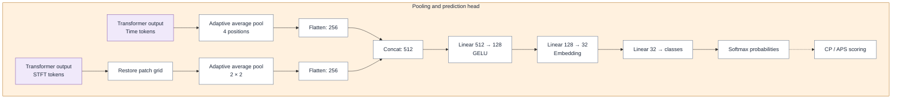
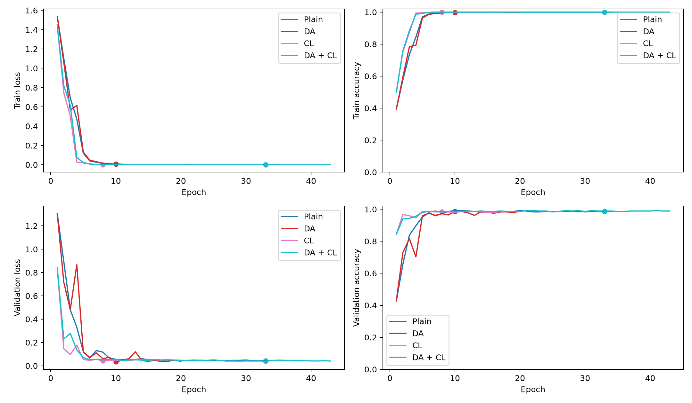
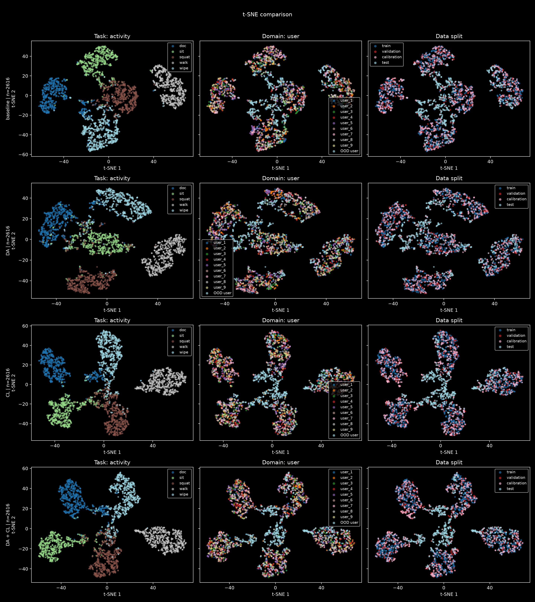
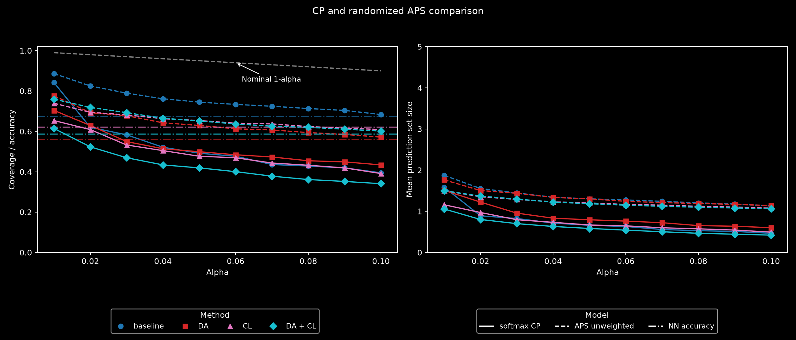
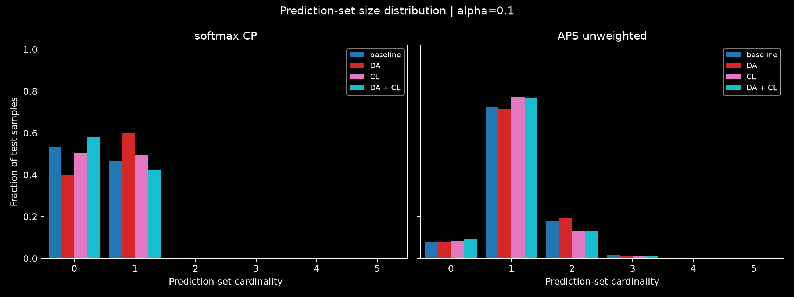

# WiFi Sensing with Conformal Prediction

This project studies domain shift in WiFi sensing by combining learned CSI representations with conformal prediction. It builds on our earlier work:

- [Solving the WiFi Sensing Dilemma in Reality Leveraging Conformal Prediction](https://dl.acm.org/doi/abs/10.1145/3560905.3568529), ACM SenSys 2022 — Kailong Wang, first author.
- [Solving the WiFi Sensing Dilemma in Reality Leveraging Conformal Prediction](https://ieeexplore.ieee.org/abstract/document/11459360), IEEE Transactions on Mobile Computing, 2026 — Kailong Wang, co-author.

Domain shift occurs when the data distribution changes between training and deployment. In WiFi sensing, different users, locations, room layouts, or device placements can alter CSI measurements and reduce classification accuracy.

Conformal prediction constructs candidate-label sets with finite-sample marginal coverage of at least `1 − alpha` under exchangeability of calibration and test examples. This distribution-free guarantee does not extend to arbitrary domain shift. We study how to maintain coverage on unseen domains while reducing empty prediction sets and favoring singleton predictions.

The earlier [SenSys framework](https://www.winlab.rutgers.edu/~yychen/daisylab/papers/Solving%20the%20WiFi%20Sensing%20Dilemma%20in%20Reality%20Leveraging%20Conformal%20Prediction.pdf) combines learned CSI representations, KDE-based nonconformity measures, and fusion of conformity information across training domains. It reports empirical improvements in activity recognition, gesture recognition, and user identification under domain variations.

## Contribution of this repository

- Fuse a **CNN–temporal Transformer** branch for time-domain CSI with a **ViT-style patch Transformer** for STFT features, capturing temporal and time–frequency dependencies.
- Evaluate on a newly collected [crossroom CSI dataset](data/README.md) with **125 recordings** comprising **4,273 extracted segments** from **10 users** performing **5 activities**.
- Combine domain-adversarial training and supervised contrastive learning to encourage consistent, task-discriminative representations across domains, with independent switches for ablation.
- Use segment-level training and calibration to obtain more calibration scores, improving empirical quantile resolution and mitigating abrupt changes in prediction sets caused by limited calibration samples.
- Construct scores directly from softmax probabilities, avoiding a separately fitted scorer. KDE, SVM, and histogram-based gradient boosting remain optional comparisons.
- Implement randomized adaptive prediction sets (APS) from [Romano, Sesia, and Candès](https://arxiv.org/abs/2006.02544), using cumulative class probabilities to adapt set size to each input.
- Evaluate coverage against the nominal target alongside set size and neural-network accuracy, aiming for compact sets with coverage close to the target.

## Network architecture

The task model uses [CNNTransformer](python/step02_models/cnn_transformer.py): a CNN stem followed by **a temporal Transformer for time-domain CSI**, and **a ViT-style patch Transformer for channel-fused STFT features**. Both branches use positional encoding and self-attention before feature fusion and classification.



Colors match the corresponding block diagrams: blue for time preprocessing, green for STFT preprocessing, purple for Transformer blocks, and orange for pooling and prediction. Gray identifies the reusable Conv block within the time stem.

<details>
<summary>Block definitions</summary>

**Conv block**



**Time stem and tokens**



**STFT fusion and patch tokens**



Patch dimensions are frequency bins × time frames.

**Transformer block**



Dropout is 0.1, including attention-weight dropout. Each branch stacks two blocks.

**Pooling and prediction head**



</details>

The two Transformer stacks have independent weights. Adversarial and contrastive objectives act on the embedding during training. With 5 classes and embedding width 32, the task model has 458,277 parameters, excluding auxiliary heads and the optional background branch.

## Results

Four CNNTransformer setups share the same held-out user and data split: Plain, domain-adversarial training (DA), contrastive learning (CL), and DA + CL. These results use one training seed and unweighted calibration.

### Training loss and accuracy

Training and validation task loss and accuracy; dots mark the selected checkpoints.



### Representation visualization and ablations

Each row shows one setup, colored by activity, user, and data split. User identities are anonymized; **OOD user** denotes the held-out target user. Each row reuses the same t-SNE coordinates across its three panels.



Embedding visualizations complement held-out-domain metrics; visual mixing alone does not establish domain invariance.

### Prediction-set coverage and size

Softmax CP and randomized APS coverage and mean set size across `alpha`, with NN accuracy as a horizontal reference. Both methods are unweighted in these runs.



Set-size distributions at `alpha = 0.1`, including empty sets (size 0). Each setup is normalized separately.



Compared with softmax CP, APS substantially reduces empty predictions, producing mostly singleton sets while improving empirical coverage.

## Workflow

1. **Prepare data.** Extract aligned, filtered CSI segments and paired STFT features with MATLAB, then convert MAT features to memory-mapped NPY files in the notebook.
2. **Train and select.** Hold out the selected target domains for test and split source segments into training, validation, and calibration sets. Train a paired-input model and select its checkpoint using validation loss. YAML controls experiments; optional W&B logging records metrics and gradients.
3. **Calibrate and evaluate.** Freeze the model. Use its probabilities directly or fit an optional scorer on training embeddings, then calibrate on the separate calibration split. Evaluate target-domain accuracy, prediction-set coverage, and set size. Optional weighting uses unlabeled target inputs; target labels are used only for evaluation.

## Run an experiment

Open [python/run.ipynb](python/run.ipynb) and run the cells in order, or execute a configured run from the project root:

```bash
python python/run_experiment.py --config python/experiments/baseline.yaml
```

See the [Python guide](python/README.md) for setup, configuration, code layout, and saved results.

## Project contents

| Directory | Contents |
|---|---|
| [data/](data/README.md) | Dataset organization, recordings, and feature formats |
| [matlab/](matlab/README.md) | CSI preprocessing and feature extraction |
| [python/](python/README.md) | Notebook, models, experiment configuration, and evaluation |

Datasets and generated experiment files are excluded from Git. Prepare the data locally before running.
